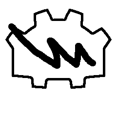
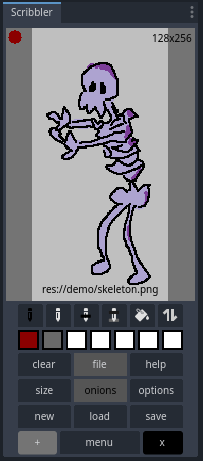
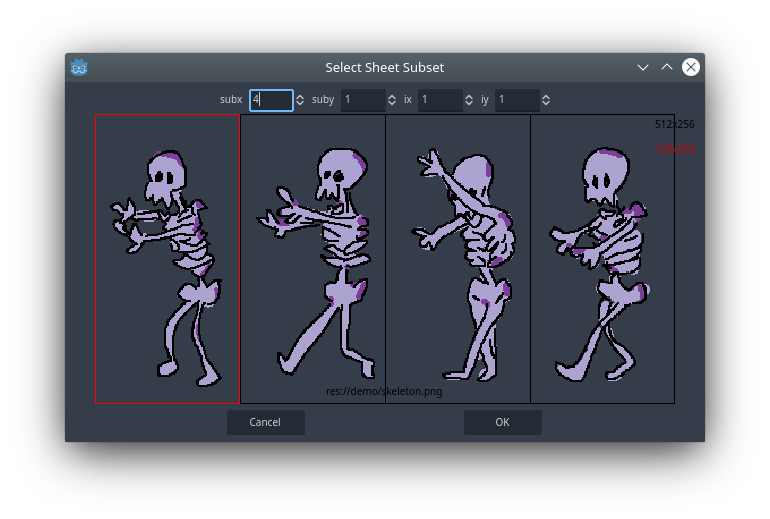
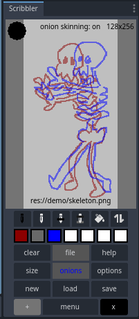

<h1>Scribbler</h1>

sul (2024), Plugin for Godot 4.2+.

A side dock to make basic drawings without leaving the Godot editor, useful for prototyping. Has basic and custom paint tools, supports drag and drop from any file/texture in editor (PNG only), onion skinning, sprite sheets, etc. Janky, minimal and tailored to drawing black outlines+fillings and shadows. Github reference: [https://github.com/sulianthual/scribbler](https://github.com/sulianthual/scribbler)

<h4>Installation</h4>

All you need is the folder "addons/scribbler" in your Godot project (with same path). Either 1) Download from [github](https://github.com/sulianthual/scribbler), then copy addons/scribbler to addons/scribbler in your project (the rest is documentation and some demo). Or 2) download from Godot Asset Library, which should install only addons/scribbler. Version from Godot Asset Library may not be latest github version.

Open your Godot project with Godot (4.2 or above), in Project Settings/Plugins enable the Scribbler Plugin. This will load the Scribbler side dock to bottom right. You can replace the dock anywhere (but dont "Make Floating"). 

<h4>Quick Overview</h4>

A quick tour without much details. Start a new drawing (press "menu" then "new"). Draw with left mouse, undo with right mouse, change pen size with mouse wheel, and swap tools with middle mouse. You can use black pen, color pen, eraser, bucket, etc (more details hereafter). Save drawing ("menu" then "save") as png file. Now drag from "file" (hold left mouse) and drop (release) to any texture in Inspector (e.g. a Sprite 2D texture), and the drawing will be applied. Inversely, drag any texture from Inspector (as long as its resource_path is a png) or any png file from FileSystem to the drawing area to load and edit it. 

I made this plugin to quickly prototype some drawings directly in the editor. The plugin is very limited in scope compared to all around painting softwares (or other very nice Godot plugins, e.g. Sprite Painter), it basically has a few minimal features I found essential (and was able to code) for myself. It can use drag and drop to quickly assign drawings, along with sprite sheets and onion skinning for animations. The plugin is also tailored toward a specific drawing style: black outlines with color fillings and shadows, for which there are specific drawing tools and key bindings. And lastly the plugin can be janky.

<h4>Main Controls</h4>

The UI consists of a drawing area, a row of drawing tools, a row of color slots and several menu buttons. The main controls are as follows:

- Press "+" in the menu to expand dock, and when expanded press "-" to minimize again. Expanding gives you more space to draw. Note: do not "Make Floating" the dock and expand/minimize altogether or the plugin will close. Best practice is to not use "Make Floating".

- Press "X" to hide the menu, press again to show. This is helpful if collapsing the dock (as buttons otherwise overlap, its basically janky).

- Press "menu" to show/hide additional buttons (again this gives you more drawing space).

<h4>Drawing Area</h4>

In the drawing area, the controls are:

- Left Mouse: Draw
- Right Mouse: Undo stroke (its binded this way because I often redo strokes)
- Mouse wheel: change pen size
- Middle Mouse: swap tools between pens/erasers (same as swap button)

Any .png resource can be dragged and dropped to the drawing area, which will load it. This can be a png file from Filesystem, a texture from the Inspector, etc (I havent tested all cases). Just make sure the resource uses a .png saved on file (as indicated in Resource/resource_path).

The pen you are currently using is shown in top left, the image size in top right (as width x height in pixels), and the .png file path (if any) at the bottom. 

<h4>Drawing Tools</h4>

The drawing tools are tailored towards drawing black outlines, color fillings and shadows (as shown in the image above). From left to right they are:

- Black Pen: A dedicated pen that only draws black, useful for making outlines. This pen has a dedicated pen size, that changes (with mouse wheel) only when black pen is selected and doesnt change when other pens are selected (this is helpful to conserve a uniform outline thickness).
- Color Pen: A classic color pen, pick its color from one of the color slots (see hereafter). 
- Color Pen Behind Black: Same as the color pen, but draws behind black strokes. Useful for making color fillings behind the outlines.
- Color Pen Behind Black and Over First Color: Same as the color pen, but draws behind black strokes and over first color encountered. The first color encountered is the color under mouse when starting stroke. Useful for making shadows over existing fillings.
- Bucket: A classic bucket, fills first color encountered. However doesnt fill over black (as outlines are supposed to stay black). 
- Swap: Swaps between drawing and eraser tools (same as middle mouse).

Next is the eraser tools (toggled with swap button), that mirror the drawing tools. From left to right:

- Black Eraser: Erases only black (outlines) and has same dedicated pen size as the black pen.
- Eraser: A classic eraser
- Eraser Behind Black: Same as eraser but doesnt erase black.
- Eraser Behind Black and Over First Color: Same as eraser but doesnt erase black, and only erases first color encountered.
- Bucket Eraser: Erases first color encountered, excluding black. Useful to remove fillings that poke out of outlines.
- Swap: Swaps between drawing and eraser tools (same as middle mouse).

Note that when using erasers, the pen indicator in top-left of drawing area still indicates drawing color but not erasing color (its like that).

<h4>Color Slots</h4>

You have seven color slots to work with:

- Right click on a color to choose its color in a popup menu.
- Left click on a color slot to apply color to pen (this only works if a color pen is selected, but not the black pen or black eraser).

You can drag any .png to a color slot, which will assign all colors found in image to the colors slots (if less then seven colors are found, remaining slots are assigned to white). To load colors of current drawing, drag from "file" to any color slot (see hereafter). 

<h4>Menu Buttons</h4>

The menu buttons are as follows:

- file: this is a reference to the png image being edited, that can be dragged and dropped elsewhere (as long as it is saved). Drag and drop to a texture (e.g. of a Sprite2D) to apply the image. Or drag and drop to the drawing area, any color slot, or to "onions". Remember to save your changes before dragging. 
- clear: clears the current drawing
- help: a very basic popup help text.
- size: opens a popup menu to resize the image. In the popup menu you can select resize mode (stretch, crop to top-left corner or crop to center), multiply/divide width and height or swap them, select from some templates, etc. Then press OK to confirm (no undo). You can drag any Vector2 from Inspector (e.g. scale) to "size" which will fill the multiply/divide factors (can be useful if resizing a sprite on screen or whatever).
- onions: used for onion skinning (see below).
- options: opens a popup with option to show a grid (still finnicky) or use sprite sheets (see below).
- new: start a new drawing
- load: load drawing from a png file in res://
- save: save drawing to a png file in res:// or overwrite existing one. When saving, all Godot resources that use the png are updated, but changes are not systematically visible in Godot editor (e.g. some textures in Inspector still display former image until reloaded, that seems to be just Godot).
- +/menu/X: hide/expand menu (as detailed above in Main Controls)

<h4>Sprite Sheets</h4>

Sprite sheets are useful to contain several sprites in a single file (e.g. for doing animations, atlas, etc). Enable using sprite sheets in options popup menu. When using sprite sheets, drawings load and save as a subregion of the image on disk. This means:

- When you load (or drop) a png, a popup appears to select subregion. Here subx, suby are the numbers of subdivisions in width, height, and ix, iy are the indices of the subregion (offsets are not supported). Pick subx and suby, select subregion with left mouse, then confirm. This will load the subregion for editing
- When you save a png, a similar popup appears to select subregion. If you are overwriting an existing png file, only the subregion will be overwritten. If you are saving a new png file, the subregion will be written with the drawing and all other regions written as transparent. Note: make sure your drawing size matches the subregion size, otherwise it will be cropped to the subregion in the saved file.

Note that using sprite sheets also applies to loading onion skins (see below).

<h4>Onion Skinning</h4>

Onion skins are semi-transparent guidelines that you can overlay on top drawing area (useful for doing e.g. animations):

- Drag any png to "onions" which will load it as a new onion skin. Typically your image is a sprite sheet, you drag it from "file" to "onions" then select one of the sprites. You can keep dragging to overlay multiple onion skins.

- Toggle onion skins visibility by clicking on "onions" with left mouse. Clear all onions skins by clicking on "onions" with right mouse. 

- By default an onion skin is the original image as semi-transparent. You can change the display to colored outlines by dragging a color from a color slot to "onions": what will happen is only black strokes from the original image will appear and they will be colored in the chosen color and semi-transparent (see image above).

- If you drop another color to "onions", colored outline will change for next loaded onion skins. Thus you can combine several onion skins with different colored outlines. To obtain the image above, we have 1) loaded a sprite sheet image, 2) dropped "file" to "onions" and selected a subregion, 3) dropped red color to "onions", 4) dropped blue color to "onions" and 5) dropped "file" to onions again and selected another subregion, and 6) cleared drawing.

<h4>Notes</h4>

- When using the plugin you will get many warnings "Loaded resource as image file", its normal.
- Within the plugin, texture filtering is set to "nearest" so drawings appear sharp, but they may not appear the same in your game if using a different texture filtering (e.g. linear). 
- This plugin is made by a amateurish Godot coder, use with caution if editing nice assets. Remember, the plugin overwrites your png assets only if you press "Save" and confirm the overwrite. Also the plugin is likely inefficient for large files (untested). 
- If the plugin closes for any reason (typically if you used "Make Floating"), just disable/reenable the plugin and it should be fine. 
- Apart from the plugin, the project has a demo folder has a few images made quickly with the plugin, as well as normal maps generated using "Laigter" (which is an awesome app). There are also some bash files in directory used for github (git_init, git_reset,git_push), dont mind those.
